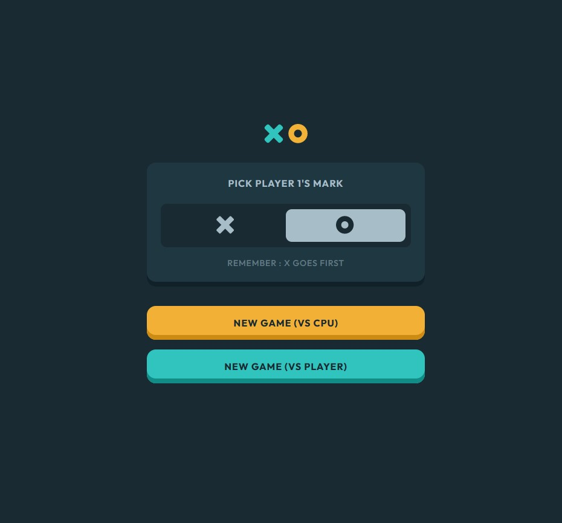
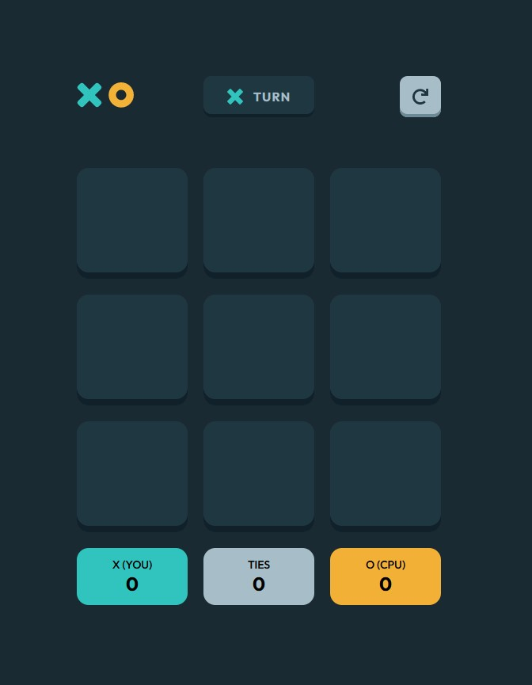
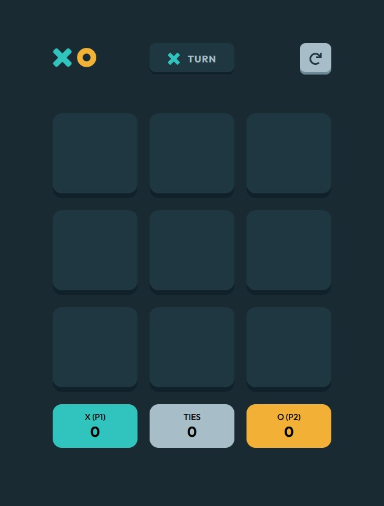
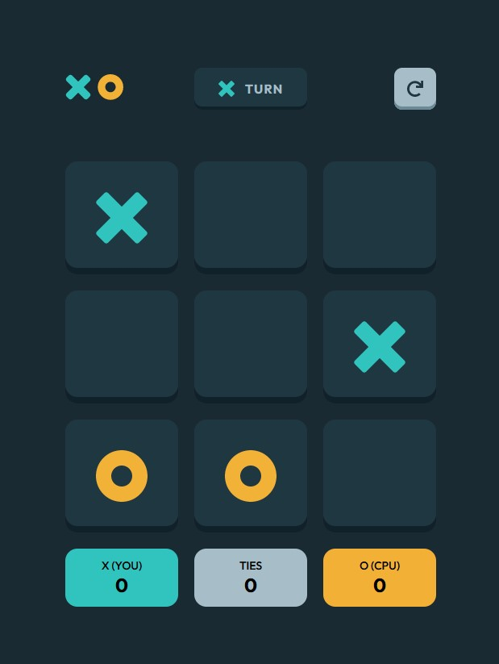
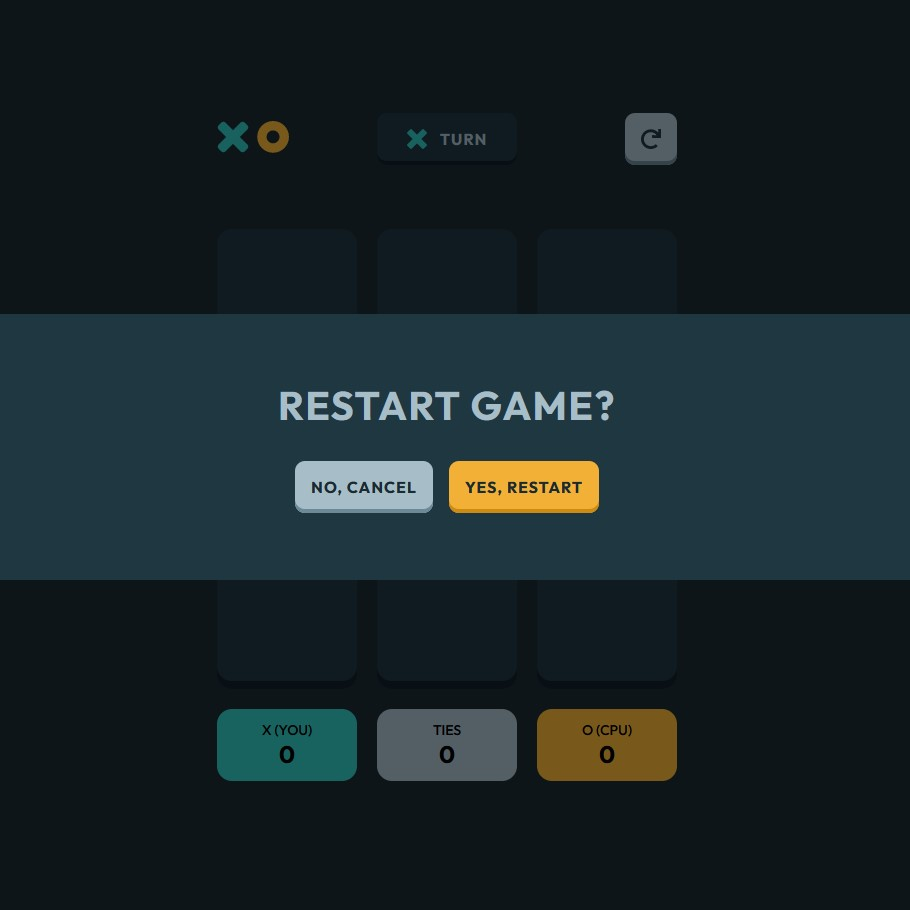
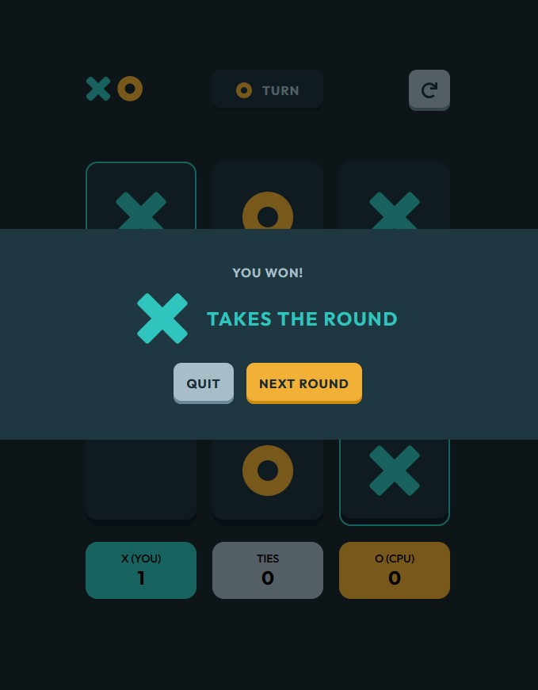
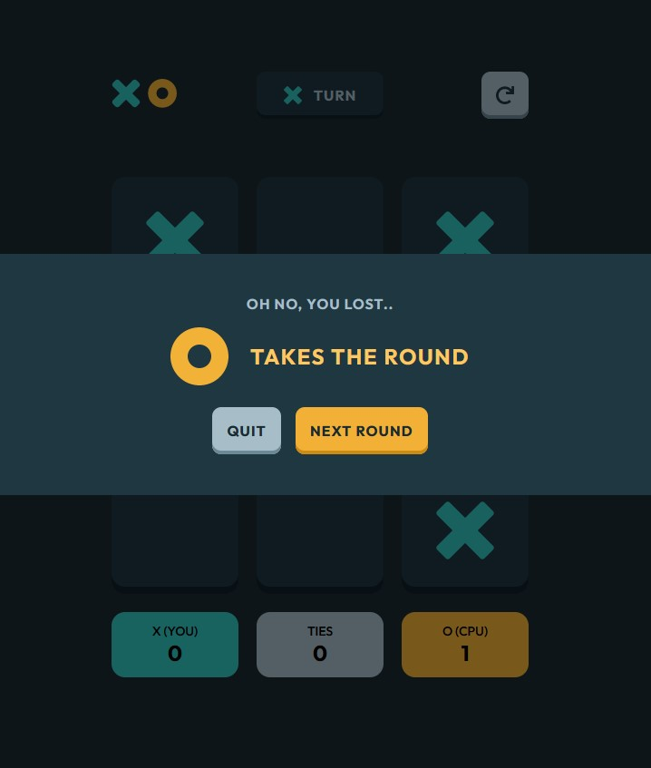
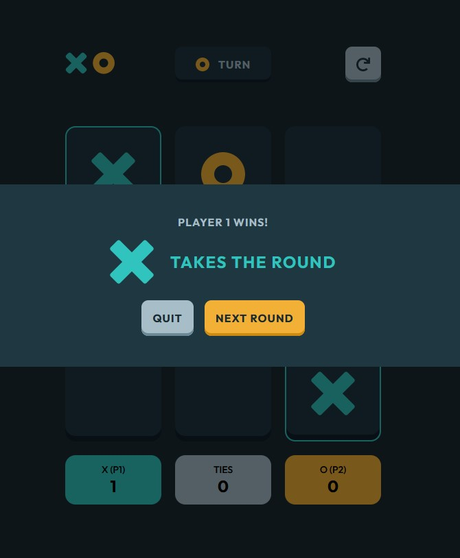
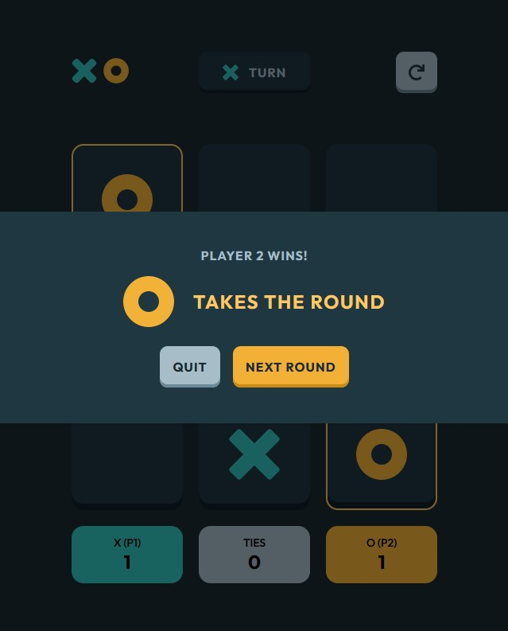
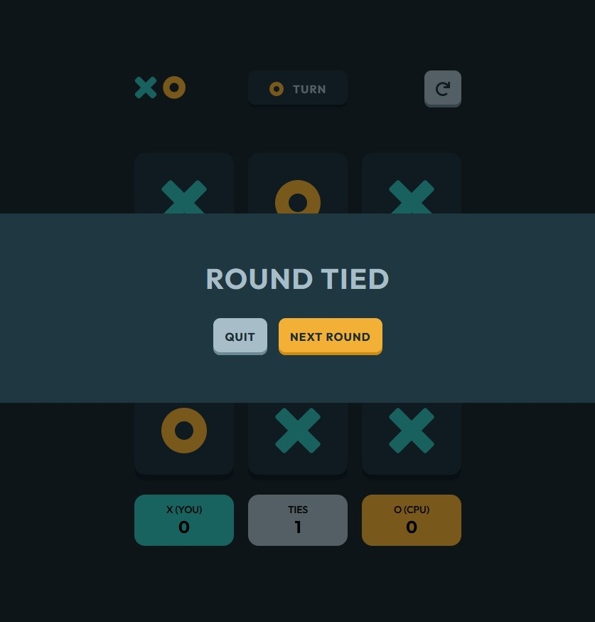

# Tic-Tac-Toe

### **_Author: Hunter Bernier_**

## **_Webpage Link:_**

[Tic-Tac-Toe](https://hmbernier55.github.io/Tic-Tac-Toe/)

## **_Webpage Screenshots:_**

### Game Menu:

### CPU Board:

### Multiplayer Board:

### Active Board:

### Restart Round Modal:

### CPU Win Modal:

### CPU Lose Modal:

### Multiplayer Player 1 Win Modal:

### Multiplayer Player 2 Win Modal:

### Round Tie Modal:

## **_Description:_**

My interpretation of a [Frontend Mentor](https://www.frontendmentor.io/home) Challenge

### The user can:

- Select a game piece (either X or O)
  - The game defaults to giving player one X if a piece it not picked
- Select to play against a computer or against another player

### Rules for Tic-Tac-Toe:

- The first to get three-in-a-row wins
  - Can be vertical, horizontal, or diagonal
- On the first game, X always goes first
  - After that, the first move alternates
- Player one selects their piece in the game menu
  - The other piece is defaulted to player two or the computer
- If all the squares have been selected and there is no winner, that game results in a tie
- During each round, the users have the option to reset the board by clicking on the reset button on the top right
- After each game, the users can either play another round or quit the game
- Scores will be updated after each round

### Computer's Logic:

- Looks for three options in a specific order:
  - Looks to win the game
  - Looks to block the other player from winning
  - Plays on a random square

## **_My process:_**

### Built with:

- Semantic HTML5 markup
- CSS custom properties
- Flexbox
- CSS Grid
- Mobile-first workflow
- Vanilla JS
- MVC (Model-View-Controller) Pattern
